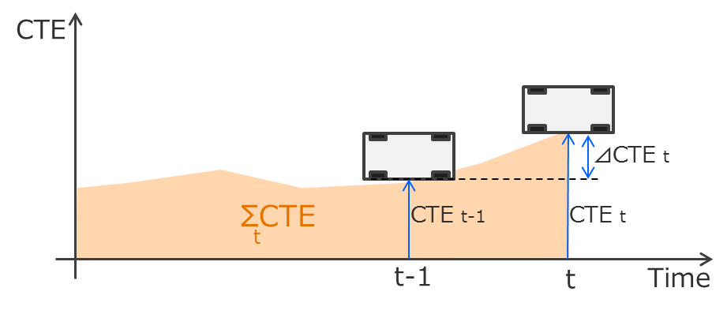

# CarND-Controls-PID
Self-Driving Car Engineer Nanodegree Program

---

## Build and Run

1. Clone this repo.
2. Make a build directory: `mkdir build && cd build`
3. Compile: `cmake .. && make`
4. Run it: `./pid`. 

## Result

My project automatically tunes two PIDs for throttle and steering with Twiddle Algorithm.

Following PID parameters are the results for each speed.

- 35mph: after 12H twiddle tuning

  - pid_throttle: Kp=3.422630, Ki=0.000366662, Kd=1.96983
  - pid_steering: Kp=0.232654, Ki=7.50166e-06, Kd=1.08217

- 60mph: initial parameter by trial and error

  - pid_throttle: Kp=0.20, Ki=0.0001, Kd=1.0
  - pid_steering: Kp=0.10, Ki=1.e-05, Kd=1.9

- 60mph: after 2H auto twiddling tune

  - pid_throttle: 
  - pid_steering: 

- over 60mph: fail to tune

  - The vehicle goes out of the course, and the auto tuning process can not keep working.

## Description

### Effect of the P.I.D.

Each of P.I.D. components 

CTE(Cross Track Error)

- P: Proportion effect

  - 
Kp(Proportional Coefficient): 
reduce CTE(Cross Track Error) in proportion to CTE value.
but also has heavy overshoot.

- I: Integration effect

  - offset

- D: Differential effect

  - prevent overshoot (mainly caused by Kp)

### The effect each of the P, I, D components

the effect of the P, I, D component of the PID algorithm in their implementation.

Visual aids are encouraged, 
i.e. record of a small video of the car in the simulator 
and describe what each component is set to.

CTE(Cross Track Error) 
 

Ki(Integral Coefficient):
reduce CTE(Cross Track Error) in proportion to CTE value.

Kd(Differential Coefficient):

### How the final hyperparameters were chosen.

Student discusses how they chose the final hyperparameters 
(P, I, D coefficients). 

This could be have been done through manual tuning,
twiddle, SGD, or something else, or a combination!

initial values

twiddle algorithm
minute adjustment/fine tuning

## Implementation

### porting Twiddle Algorithm

To consecutively tune the two PIDs,
I had the Twiddle Algorithm converted into state-machine style as bellows:

original Twiddle Algorithm pseudo code from the lesson:

Twiddle Algorithm pseudo code:

        best_err = measurement()
        for param, dparam in zip(all_params, all_dparam):
            param += dparam
            err = measurement()
            if err < best_err:
                best_err = err
                dparam *= 1.1
            else:
                param -= 2 * dparam
                err = measurement()
                if err < best_err:
                    best_err = err
                    dparam *= 1.1
                else:
                    param += dparam
                    dparam *= 0.9

    statemachine-style algorithm pseudo code:
    
        state0: first measurement
            best_err = measurement()
            param += dparam // for positive trial
            err = measurement()
            goto sate 1
        
        state1: post positive trial
            if err < best_err:
                best_err = err
                dparam *= 1.1
                next_param += next_dparam
                err = measurement()
                goto state 1 w/ next param
            else:
                param -= 2 * dparam // negative trial
                err = measurement()
                goto sate 2
        
        state2: post negative trial
            if err < best_err:
                best_err = err
                dparam *= 1.1
                next_param += next_dparam
                err = measurement()
                goto state 1 w/ next param
            else:
                param += dparam // back to positive gain (state 1)
                dparam *= 0.9 // suppress gain
                next_param += next_dparam
                err = measurement()
                goto state 1 w/ next param

While the original Twiddle Algorithm code assumes off-line use,
my code enables on-line tuning.

This feature is very convenient to tune plural PIDs automatically.

### Exclusive Twiddling

Runing two twiddle algorithms concurrently caused conflict and vehicle control failure,
before getting adequate PID parameters.

So I added an exclusive logic to the two Twiddle functions in main() as following code.

     // PID for Steering
     pid_steering.UpdateError(cte);
     steer_value = std::max(-1., std::min(+1., - pid_steering.TotalError())); // limit in [-1, 1].
     double speed_err = target_speed - speed;

     // exclusive control for two twiddles
     if (pid_steering.is_tuned && pid_throttle.is_tuned) {
        std::cout << "start twiddle for throttle" << std::endl;
        pid_throttle.is_tuned = false;
     }

     // PID for Throttle
     pid_throttle.UpdateError(speed_err);
     throttle_value = std::min(1., pid_throttle.TotalError());

     // exclusive control for two twiddles
     if (pid_throttle.is_tuned && pid_steering.is_tuned) {
        std::cout << "start twiddle for steering" << std::endl;
        pid_steering.is_tuned = false;
     }

Therefore,
my project can prevent the conflict and tune the two PIDs alternately.

## Parameter Tuning

## Consideration

As the speed became faster,
Twiddle Algorithm seemed to take large Kp(=proportinal weight).

This is reasonable behaviour to tune to high speed drive,
but Kp's overshoot exceed road width around 45mph speed.

For more improvement,
stabilization may be needed for my project.

# EOF
